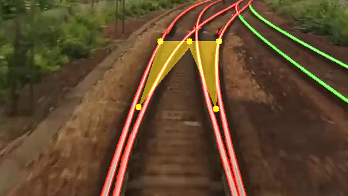
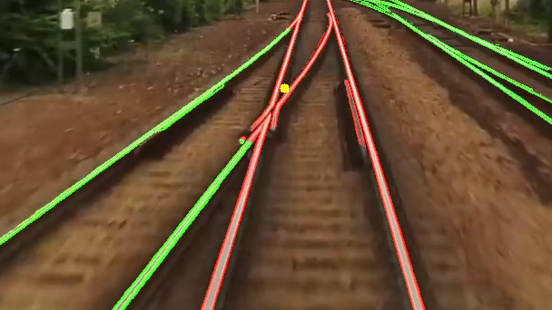
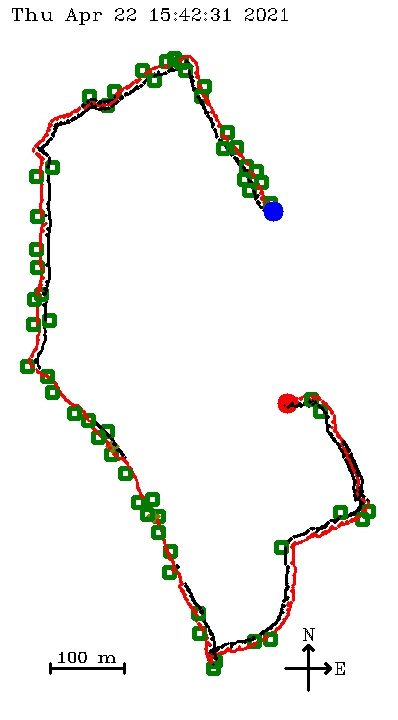

# Vision System For an Autonomous Railway Maintenance Vehicle
This project was a Master's thesis project at Chalmers University of Technology, spring 2021. The project was a part of a larger project at Chalmers, led by Krister Wolff and financed by the Swedish Transport Administration, to develop a prototype of an autonomous railway vehicle that can be used for inspection and maintenance of railway infrastructure. 

The aim of this project was to develop a vision system for the autonomous railway vehicle. 

## Description
The vision system is divided into two parts, track detection and object detection. Functionalities for retrieving GPS data and storing such data together with the output from the vision system are also provided.

### Track Detection
The track detection algorithm detects tracks and railway switches by an region-growing algorithm based on image intensity gradients. The implemented method requires a high contrast between the rails and the background, and thus works fine in good lighting conditions. The algorithm often has problems when the contrast between the rails and background is low. 

Below are some images showing the detected main track in red and sidetracks in green. 

A railway switch is detected with yellow dots. 

  
   

A warning zone is created around the main track to inform about persons or vehicles dangerously close to the track. 

### Object Detection
The object detection algorithm detects vehicles (bicycle, bus, car, motorbike, train, truck) and persons as well as some objects common in Swedish railway infrastructure such light signals (main signal, distant signal, road crossing signal, distant road crossing signal), signal boards (speed sign, ATC speed signs, warning sign, distant signal sign, V-sign), catenary support structure poles, road crossings, and road crossing barriers. The object detection algorithm mainly uses the YOLOv4 neural network to identify and locate the objects of interest. The messages of the light signals and the speed sign are classified by their individual classification neurals networks. All objects are detected with some kind of temporal robustness implemented.

### GPS and Localization
A GPS node was created to be run via ROS. The GPS node fetches GPS data (position, time, and speed) and publishes it via the `gps_topic` in ROS. A localization node subsribes to that topic and the output from the vision system, and store the information from these two in a text-file for later use. The data in this text-file can be converted to a map by the `DrawLocalizationMap.cpp` program.

 

## Software Requirements
* OpenCV

* Darknet (Windows), or
    * Install from [https://github.com/AlexeyAB/darknet](https://github.com/AlexeyAB/darknet)

* TensorRT (Linux)
    * Requires OpenCV with CUDA support

* ROS (Optionally)
    * Only needed for the camera, GPS, and localization functionalities. Can run the vision system without it.

The vision system was tested with Darknet on Windows and on TensorRT on Linux on a NVIDIA Jetson Nano. This can changed in the code.

## How To Use
The created programs have been tested on an NVIDIA Jetson Nano connected to an Adafruit Ultimate GPS Breakout module via USB and two Arducam 12.3 MP IMX477 camera modules via the CSI connectors.

The vision 

The programs can be run via the Robot Operating System (ROS) via launch files:

`vision.launch` starts the vision and camera nodes, without visual output for optimal performance.

`visionShow.launch` starts the vision and camera nodes as well as a display of the visual output.

`vision_gps_localization.launch` starts the vision and camera nodes as well as the localization and GPS nodes, without visual output.

The vision and GPS node outputs can be fetched from the `vision_topic` and `gps_topic` respectively. The output image from the vision node is provided in the `vision_image_topic`. The input image from the active camera is published by the camera node to the `camera_topic`.

Some information and usable ROS commands are provided in the ´ROSCommands.txt´ file. Commands can be sent at runtime to the camera and vision nodes by

`rostopic pub -1 vision_input_topic vision/vision_input_message [command]`

with `[command]` being:

    0: Turn ON visualization of vision output
    1: Turn OFF visualization of vision output
    2: Use FORWARD camera
    3: Use BACKWARD camera
    4: Exit

The most important settings of the vision node are set via the `Parameters.txt` file. Here it is able to toggle between camera and prerecorded video (from the `Videos` folder) input and decide if the output video should be saved (in the `Saved Videos` folder).

To run the programs via ROS, cameras have to be connected to both the NVIDIA Jetson Nano CSI connectors.

The vision system functionalities can also be run independent of ROS.
